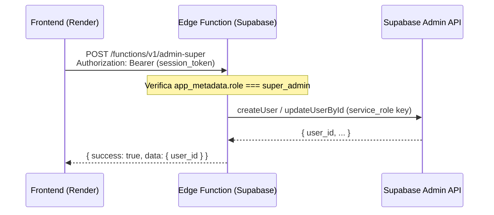

# Edge Function: `admin-super`

> Reemplaza el `adminClient` (service_role key en frontend) por una Edge Function serverless de Supabase.
> La web sigue siendo 100% static hosteada en Render.

## Problema

`admin-client.js` expone la `service_role` key de Supabase en el bundle JS del frontend.
Esta key bypassa RLS y otorga acceso total a la base de datos.
Además, la librería `@supabase/supabase-js` valida que la key no esté vacía y lanza
`"supabaseKey is required"`, rompiendo la app si la variable de entorno no está definida.

## Solución

Edge Function en Supabase (Deno) que actúa como proxy serverless para las operaciones
de Admin Auth API. La `service_role` key vive solo como secreto de Supabase, nunca en el frontend.

## Arquitectura



## Endpoint

### `POST /functions/v1/admin-super`

**Headers:**
```json
{
  "Authorization": "Bearer <access_token_del_super_admin>",
  "Content-Type": "application/json"
}
```

**Actions:**

| Action | Body | Descripción |
|--------|------|-------------|
| `create_user` | `{ email, password, role, business_id? }` | Crea usuario en Auth |
| `update_user` | `{ user_id, app_metadata }` | Actualiza metadata del usuario |

**Response éxito:**
```json
{ "success": true, "data": { "user_id": "uuid" } }
```

**Response error:**
```json
{ "success": false, "error": "mensaje descriptivo" }
```

## Archivos

| Archivo | Acción |
|---------|--------|
| `supabase/functions/admin-super/index.ts` | **CREAR** — Edge Function en Deno |
| `src/lib/admin-client.js` | **ELIMINAR** — ya no se necesita |
| `src/pages/admin/SuperDashboard.jsx` | **MODIFICAR** — usar `fetch()` a la Edge Function |

## Seguridad

1. `service_role` key almacenada como **secreto** en Supabase:
   - Dashboard → Edge Functions → `SUPABASE_SERVICE_ROLE_KEY`
2. La función verifica el rol del caller:
   ```ts
   const user = supabase.auth.getUser(token)
   if (user.app_metadata.role !== 'super_admin') throw new Error('Forbidden')
   ```
3. No hay cambios en Render — sigue siendo static site.

## Consideraciones

- **Rate limiting**: Supabase Edge Functions tiene rate limiting por defecto
- **Timeout**: 60s por defecto, más que suficiente para crear un usuario
- **Deploy**: `supabase functions deploy admin-super` (CLI de Supabase)
- **Costo**: Incluido en el plan Free de Supabase (500k invocaciones/mes)

## Dependencias

- Supabase CLI instalada localmente
- `supabase/functions/` en la raíz del proyecto (ya existe en proyectos con Edge Functions)
- Ninguna dependencia nueva en el frontend

## Próximos pasos

1. Instalar/configurar Supabase CLI si no está
2. Crear `supabase/functions/admin-super/index.ts`
3. Configurar el secreto `SUPABASE_SERVICE_ROLE_KEY`
4. Eliminar `admin-client.js`
5. Actualizar `SuperDashboard.jsx`
6. Probar localmente con `supabase functions serve`
7. Deployar con `supabase functions deploy admin-super`
